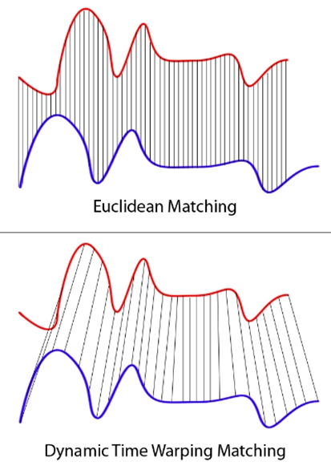

*A demo of code. Note how fast the optimized algorithms are, compared with brutal force. Over 95% of the entries are skipped.*

## Introducing Dynamic Time Warping Distance into Matrix Profile

*This repository is about an academic project on time series data mining.* 

- For instructions on how to compile and use the code for the project, click [here](#user-content-instructions).

- For an abstract and emprical results of the project, click [here](#user-content-summary).

- For more information about this project, click [here](#user-content-more-information).

---

Matrix Profile (MP) has emerged as a new concept in the data mining community since 2016. It is a framework to extract information from time series, which can be later applied in similarity research. Two steps are involved:

1. construct a matrix profile
2. use the matrix profile

In step 1, the current setting uses traditional Euclidean distance to measure how similar two subsequences are. However, a better approach would be using Dynamic Time Warping (DTW) distance. See the graph below for intuition.

As an initial attempt in the academic community, I introduced DTW into MP.

The main challenge is -- the time complexity for computing DTW is sizeable even for a single pair of points. It is infeasible to compute them for all the pairs in a matrix.

My originalities are

1. computing lower bounds to skip many unnecessary computations
2. using randomized local search within each column of the matrix

### Instructions

The instructions on how to compile and use my code, and a full description of every source file and the accompanying dataset is [here](README.pdf) (PDF).

### Summary

An abstract of this project is [here](summary/abstract.pdf) (PDF).

The empirical results are [here](summary/results.pdf) (PDF).

### More Information

This project is an academic project.

[Back to Top](#user-content-introducing-dynamic-time-warping-distance-into-matrix-profile)
